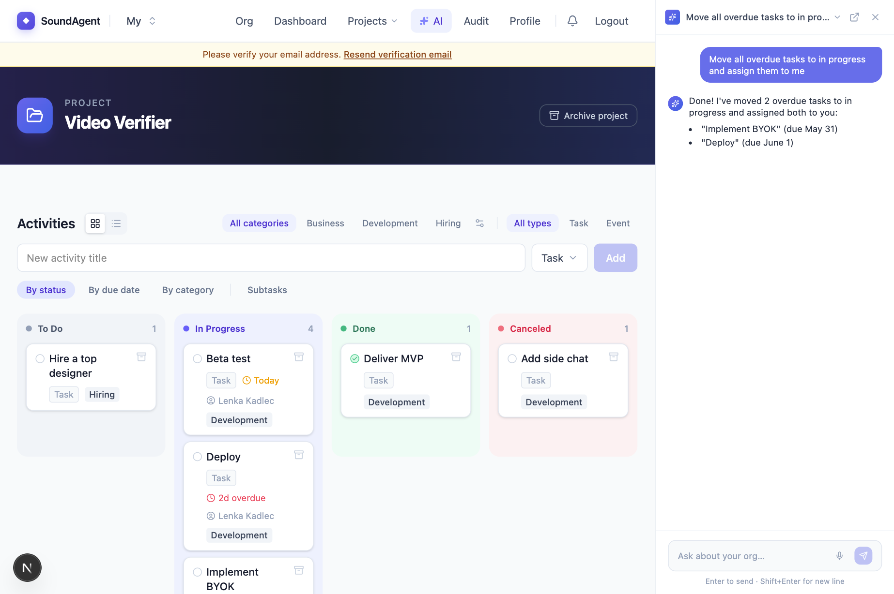
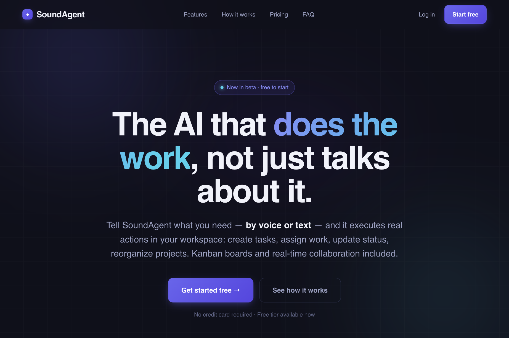
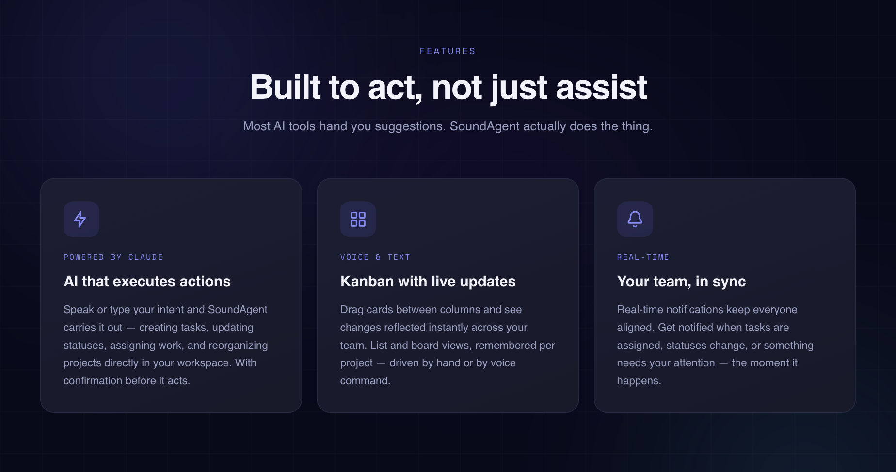
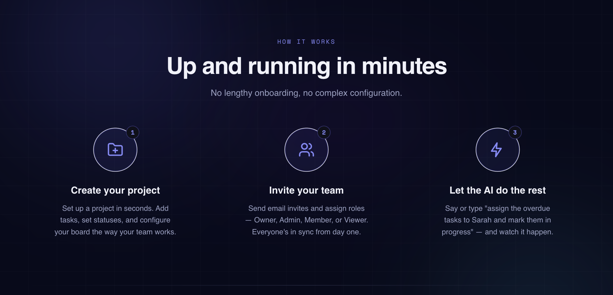
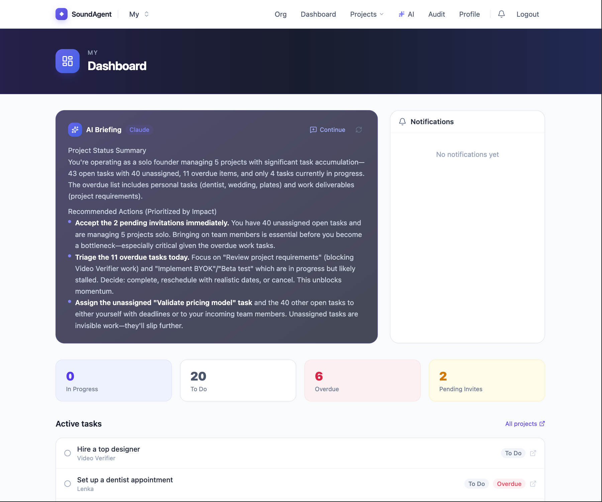
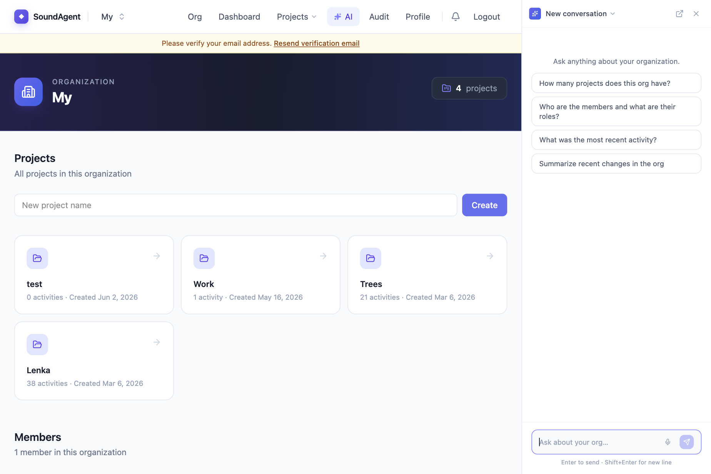
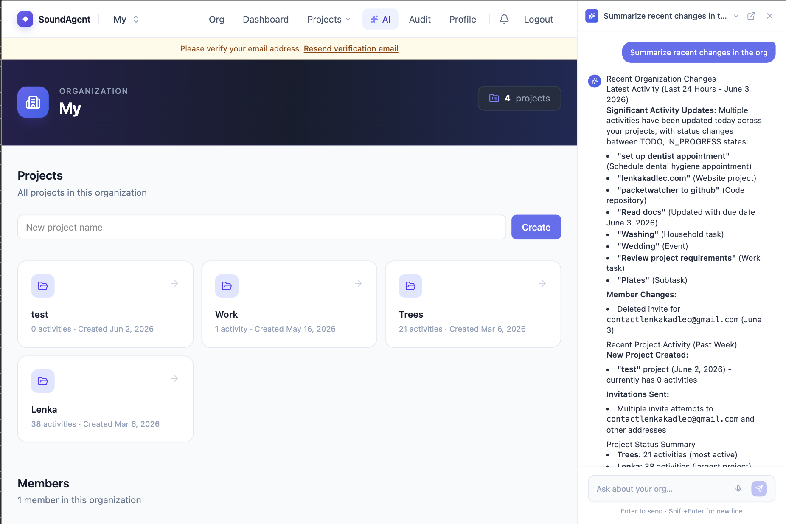
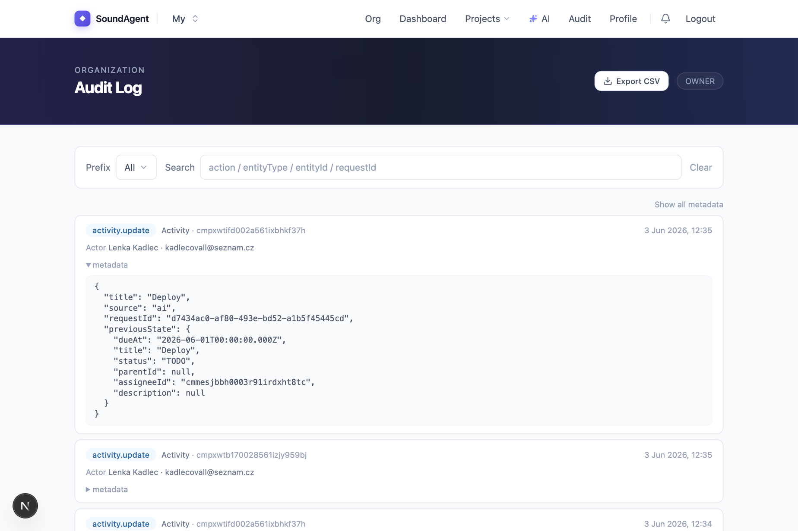

# SoundAgent.io

**AI-native project management with a voice interface.** · [soundagent.io](https://soundagent.io)

SoundAgent is a multi-tenant SaaS platform where the AI assistant is a first-class citizen — not a chatbot bolted on the side. It can answer questions about your organisation, navigate the app, and perform mutations (create tasks, invite members, switch orgs) through typed tool calls backed by real database queries. A hands-free, real-time speech-to-speech loop lets you run the whole app without touching a keyboard.

---

---

## Features

- **Kanban board** — drag-and-drop tasks across status columns, subtask hierarchies, categories, assignees, due dates and recurrence
- **AI assistant** — conversational interface that understands your org's data and can act on it; full conversation history persisted per user
- **Voice mode** — hands-free, real-time **speech-to-speech**: talk to the assistant and it talks back with sub-second latency, calling the same tools to read and change your data mid-conversation
- **Audit log** — every mutation is logged with actor, entity and metadata; queryable by the AI
- **Multi-tenancy** — org switching, role-based access control (OWNER / ADMIN / MEMBER / VIEWER), email invitations
- **Real-time notifications** — Pusher-backed in-app feed
- **Billing** — Lemon Squeezy subscription tiers with webhook-driven plan enforcement
- **Security** — conversation data encrypted at rest, RBAC at every server boundary

---

## Screenshots

**Landing page**

<table>
<tr>
<td></td>
</tr>
<tr>
<td></td>
<td></td>
</tr>
</table>

**App**

<table>
<tr>
<td colspan="2"></td>
</tr>
<tr>
<td></td>
<td></td>
</tr>
<tr>
<td></td>
<td></td>
</tr>
</table>

---

## Stack

| Layer     | Technology                                      |
| --------- | ----------------------------------------------- |
| Framework | Next.js 16 App Router + React Server Components |
| Database  | PostgreSQL via Prisma on Supabase               |
| Auth      | NextAuth.js (credentials + email verification)  |
| AI (text) | Anthropic Claude Haiku                          |
| Voice     | OpenAI Realtime API (`gpt-realtime`, speech-to-speech over WebRTC) |
| Real-time | Pusher private channels                         |
| Billing   | Lemon Squeezy                                   |
| Styling   | Tailwind CSS + Radix UI                         |

---

## Architecture

See [`ARCHITECTURE.md`](ARCHITECTURE.md) for a full breakdown of the data model, auth, AI assistant, voice interface, RBAC and security approach.

---

## Code examples

Annotated excerpts from the codebase illustrating key design decisions:

| File                                                           | What it shows                                                                    |
| -------------------------------------------------------------- | -------------------------------------------------------------------------------- |
| [`examples/rbac.ts`](examples/rbac.ts)                         | Role × permission matrix — single `can()` call enforced at every server boundary |
| [`examples/activity-tree.ts`](examples/activity-tree.ts)       | O(n) recursive tree builder using a pre-built `childrenMap`                      |
| [`examples/speech-detection.ts`](examples/speech-detection.ts) | Pure functions for RMS-based speech frame detection, fully unit-tested           |

---

## Project status

Active development. Used in production.

---

_Built by [Lenka Kadlec](https://github.com/lenkakadlec)_
